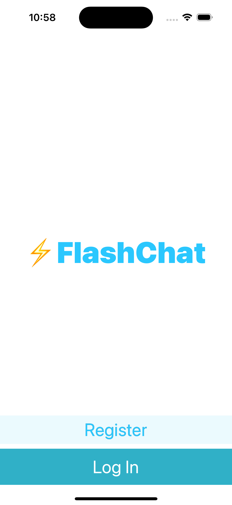
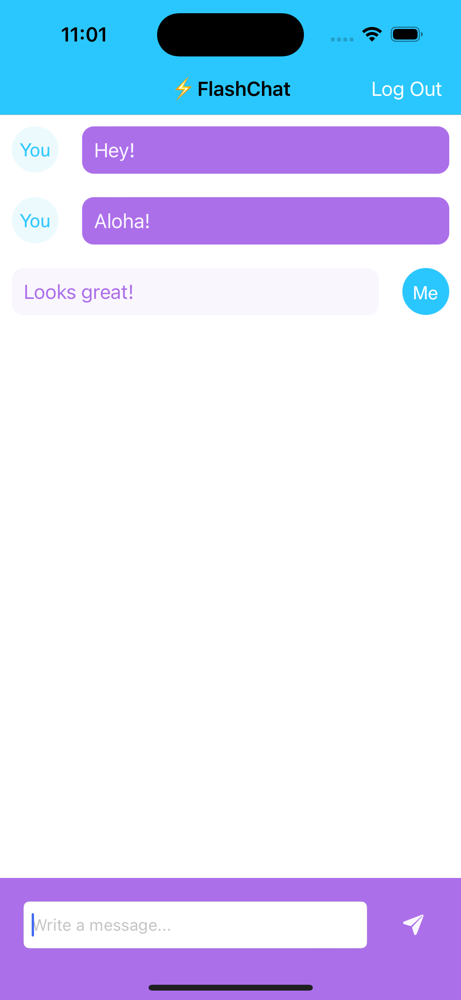

# Project Name: Swift Chat App






## Description

This Swift project, created using UIKit, serves as a practical example of integrating various technologies and concepts into a chat application. Through this project, you will learn how to use CocoaPods to incorporate the CLTypingLabel library, as well as how to use Swift Package Manager (SPM) to install the Firebase SDK and IQKeyboardManagerSwift. You will also gain insight into configuring the AppDelegate, managing the view lifecycle with `viewWillAppear` and `viewWillDisappear` methods, integrating Firebase for authentication and user registration, and creating different chat views based on the logged-in user.

## Features

- User-friendly welcome and registration screens.
- Real-time chat functionality.
- Seamless integration with Firebase for authentication and data storage.
- Dynamic chat interface with different views based on user credentials.

## Prerequisites

Before you begin, ensure you have met the following requirements:

- Xcode (version 15.0 or higher)
- Swift (version 5.0)
- CocoaPods
- Swift Package Manager (SPM)

## Installation

1. Clone the repository:

   ```shell
   git clone https://github.com/luuanfaria/flash-chat-iOS13.git
   ```

2. Install dependencies using CocoaPods:

   ```shell
   cd flash-chat-iOS13
   pod install
   ```

3. Open the project in Xcode:

   ```shell
   open flash-chat-iOS13.xcworkspace
   ```

4. Install Firebase SDK and IQKeyboardManagerSwift via SPM:
   - In Xcode, navigate to File > Swift Packages > Add Package Dependency...
   - Enter the Firebase and IQKeyboardManagerSwift repository URLs and follow the prompts to install them.

5. Configure Firebase in your AppDelegate by following Firebase setup instructions.

6. Build and run the project in Xcode.

## Usage

1. On the welcome screen, users can log in if they have an existing account or register for a new one.

2. After logging in or registering, users will be directed to the chat interface.

3. The chat interface varies based on the user's credentials, providing different views and functionality.

4. Users can start chatting and enjoy the real-time chat experience.

## Contact

If you have any questions or suggestions, feel free to contact me:

- Website: [luuanfaria.dev](https://luuanfaria.dev)
- LinkedIn: [linkedin.com/in/luuanfaria](https://linkedin.com/in/luuanfaria)
- Twitter: [twitter.com/luuanfariaf](https://twitter.com/luuanfariaf)

## Credits

This project is part of The App Brewery's Complete App Development Bootcamp. For a comprehensive app development learning experience, check out the full course at [www.appbrewery.co](https://www.appbrewery.co/).